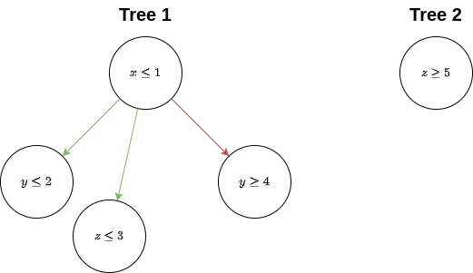
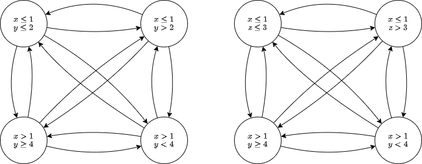

===============
Branches Module
===============

Introduction
============

This module defines the tree structure used to represent a set of nested conditional expressions.
When analyzing a function, a separate tree will created for each set of independent conditional
expressions. Given the example below:

.. code-block:: python

   def f(x, y, z):
      if x <= 1:
         if y <= 2:
            ...
         else:
            ...

         if z <= 3:
            ...
         else:
            ...
      else:
         if y >= 4:
            ...
         else:
            ...

      if z >= 5:
         ...
      else:
         ...

analysis of this function will result in a set of trees that looks like the following:

For the first tree, there are two children that correspond to the nested independent conditional
statements in the *true* block of the first conditional expression and one child that corresponds
to the only nested statement in the *false* block. The second tree represents the independent second
top-level conditional expression.

Conversion of a :py:class:`.BranchTree` into a :py:class:`.Kripke` structure will actually result in
a set of Kripke structures formed by taking all unique combinations of both the true and false
children. Therefore, converting the first tree from the function above will produce the following
set of Kripke structures:

Classes
=======

.. autoclass:: bsa.branches.Comparison
   :members:

.. autoclass:: bsa.branches.Condition
   :members:

.. autoclass:: bsa.branches.BranchTree
   :members:

.. autofunction:: bsa.branches.active_branches
